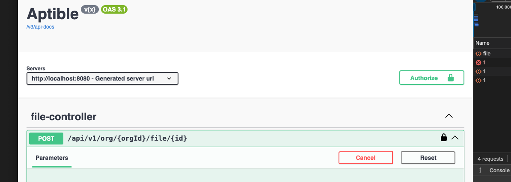

# Intro

Things could be cleaned up but took a few liberties in place of cleanliness to potentially explore during live session. 

## How to run
A few docker files are present in the repo

This should set everything up with an SSO provider + run app with its own postgres instance
```
docker-compose -f authentik/docker-compose.yaml up -d
docker-compose -f docker-compose-run.yml up -d
```

Swagger api docs for easy endpoint interactions
http://localhost:8080/swagger-ui/index.html

There is a stateless version of auth under LoginController in swagger docs with some hardcoded behavior - in place of implementing any user database/roles.
When provided a token from response simply place the value returned in the Authorize spot in swagger


If SSO is desired it may require some setup if using

http://localhost:9000/if/flow/initial-setup/

You will need to follow instructions of setting up an SSO OIDC provider for authentik - more docs here if needed https://docs.goauthentik.io/
```
Steps:
- create app in authentik
- (should promp to create associated provider)
- select OIDC
- follow prompts
- set redirect URL to http://localhost:8080/login/oauth2/code/aptible
```

when provided with clientId/Secret
can update `OauthConfig.java` with the values accordingly


SSO login can be found here - currently application will use a stateful session for SSO (tracked as a cookie in your browser)
http://localhost:8080/dlogin


## DB config
Some config can be found under `application.properties`. To have this auto drop-create schema VS just update schema swap the following in/out
```
spring.jpa.hibernate.ddl-auto=create-drop
#spring.jpa.hibernate.ddl-auto=update
```

## TODO/Improvements
Running up on time a bit so pushing this for the time being.... can come back and clean things up time permitting

- Paging
- Better search interface for files - solr/elasticsearch - find by name..
- code cleanup
- SSO/Auth pattern clarity + lockin
- Customer specific s3 config + s3 keys
